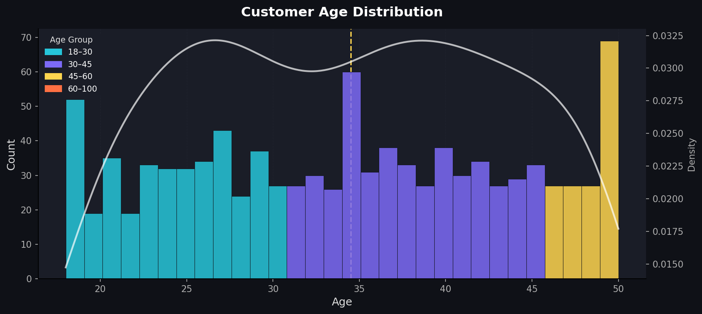
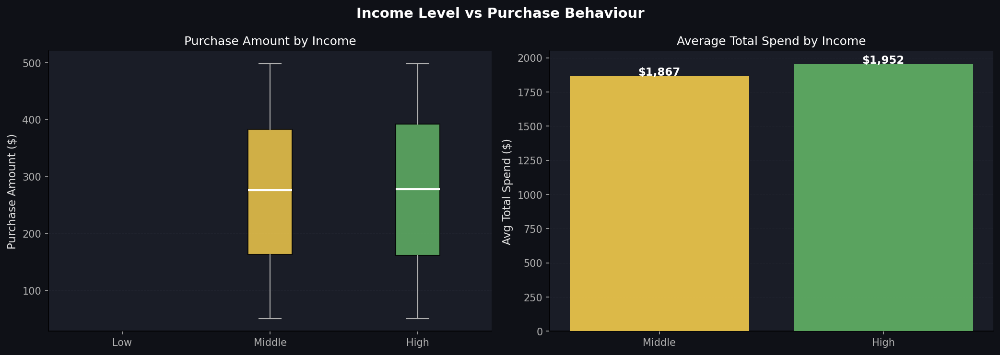
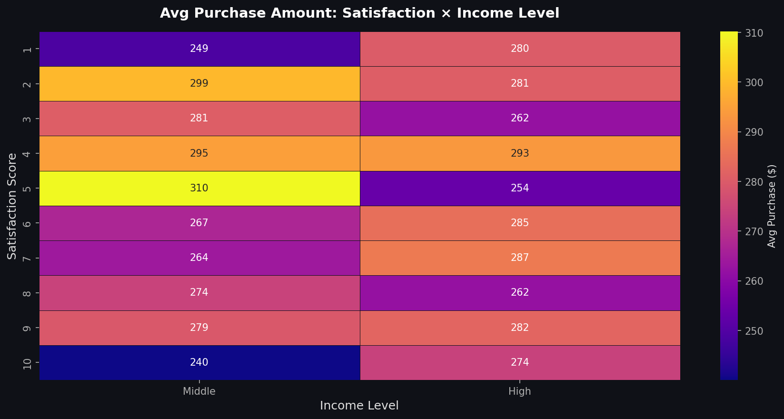
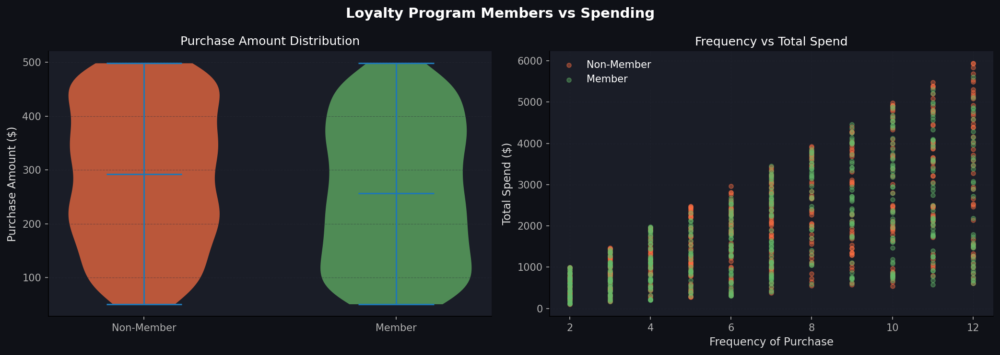
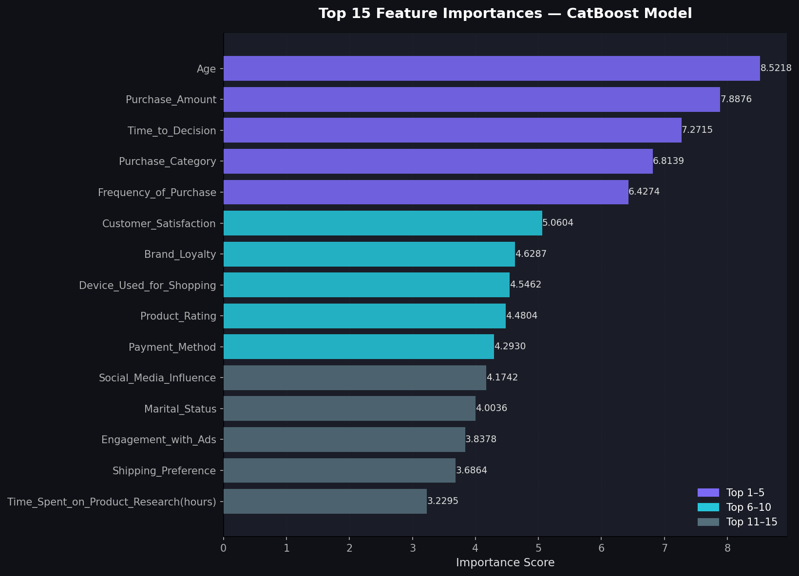

# E-Commerce Consumer Behavior Analysis

This project analyzes consumer behavior in an e-commerce context to understand purchasing patterns, identify key influencing factors, and build a predictive model for discount usage. The analysis involves comprehensive data cleaning, exploratory data visualization, and a machine learning pipeline to predict whether a customer will use a discount.

## Data Cleaning Summary

The initial dataset underwent several cleaning steps to ensure data quality and prepare it for analysis and modeling:
- **Purchase_Amount**: Converted from string (e.g., '$123.45') to a numeric (float) type by removing '$' and commas.
- **Missing Values**: Filled missing values in `Social_Media_Influence` and `Engagement_with_Ads` columns with 'None' to treat them as a distinct category.
- **Categorical Ordering**: Converted `Income_Level`, `Discount_Sensitivity`, and `Social_Media_Influence` into ordered categorical types for better representation and potential ordinal encoding in ML.
- **Boolean Conversion**: Transformed `Discount_Used` and `Customer_Loyalty_Program_Member` columns to boolean types.
- **Derived Feature**: Created a new feature `Total_Spend` by multiplying `Purchase_Amount` and `Frequency_of_Purchase` to capture overall customer value.

## Visualizations

### Visualization 1: Customer Age Distribution
This histogram shows the distribution of customer ages, with a Kernel Density Estimate (KDE) overlay to visualize the density curve. Bars are color-coded by age group, providing quick insights into the demographic spread of the customer base. A median age line is included for reference.

### Visualization 2: Income Level vs Purchase Behaviour
This section features two plots. The first is a box plot illustrating the distribution of `Purchase_Amount` across different `Income_Level` categories (Low, Middle, High). The second bar chart displays the average `Total_Spend` for each income level, highlighting how income correlates with spending habits.

### Visualization 3: Top 10 Product Categories
This visualization identifies the most popular product categories based on purchase frequency and average purchase amount. Two horizontal bar charts are presented: one for the count of purchases per category and another for the average spend within each category. This helps in understanding which products are most frequently bought and which generate higher revenue per purchase.

### Visualization 4: Purchase Channel Breakdown
This section uses a donut chart to show the market share of different purchase channels (e.g., Online, In-Store, Mixed). Alongside, a bar chart illustrates the average purchase amount for each channel, providing insights into channel effectiveness and customer preferences.

### Visualization 5: Average Purchase Amount: Satisfaction × Income Level
This heatmap visualizes the average `Purchase_Amount` across different levels of `Customer_Satisfaction` and `Income_Level`. It helps identify segments of customers (e.g., high-income, highly satisfied) who tend to make larger purchases.

### Visualization 6: Loyalty Program Members vs Spending
This visualization explores the relationship between customer loyalty program membership and spending habits. A violin plot compares the `Purchase_Amount` distributions between members and non-members. A scatter plot further shows the correlation between `Frequency_of_Purchase` and `Total_Spend` for both groups, highlighting the value of loyal customers.

### Visualization 7: Social Media Influence on Purchasing
This section examines the impact of social media influence on customer behavior. It includes a bar chart showing the count of customers across different levels of social media influence (None, Low, Medium, High), and another bar chart illustrating the average purchase amount for each influence level.

### Visualization 8: Discount Sensitivity Analysis
This visualization analyzes customer sensitivity to discounts. One bar chart displays the percentage of customers who used a discount within each sensitivity group (`Not Sensitive`, `Somewhat Sensitive`, `Very Sensitive`). Another grouped bar chart compares the average purchase amount for those who used a discount versus those who didn't, across the sensitivity groups.

## Machine Learning Model

To understand and predict `Discount_Used`, a CatBoost Classifier was trained. The ML pipeline involved several key steps:
- **Feature Engineering**: Irrelevant columns like `Customer_ID`, `Location`, and `Time_of_Purchase` were dropped. Boolean features were converted to integers.
- **Label Encoding**: All categorical and object type features were converted into numerical representations using Label Encoding.
- **Data Splitting**: The dataset was split into training and testing sets (80/20 ratio) with stratification to maintain class proportions of the target variable.
- **Feature Scaling**: Numerical features were scaled using `StandardScaler` to normalize their ranges.
- **Model Training**: A CatBoost Classifier was chosen for its robustness with categorical features and ability to handle class imbalance (using class weights) to predict `Discount_Used`.

### Visualization 9: CatBoost — Confusion Matrix & Performance Metrics
This section provides a detailed evaluation of the trained CatBoost model. A confusion matrix heatmap visually represents the model's true positives, true negatives, false positives, and false negatives. A bar chart displays key classification metrics such as Accuracy, Precision, Recall, and F1-Score, with a random baseline for context.

### Visualization 10: Top 15 Feature Importances — CatBoost Model
This horizontal bar chart illustrates the relative importance of features in the CatBoost model's prediction of `Discount_Used`. The top 15 features are displayed, helping to identify which aspects of consumer behavior most significantly influence discount usage.

## Setup and Usage

To run this notebook and reproduce the analysis and visualizations, follow these steps:

1.  **Install Dependencies**: Execute the first code cell (`Section 1`) to install all necessary Python libraries (e.g., `imbalanced-learn`, `catboost`, `scipy`).
2.  **Import Libraries**: Run the `Section 2` code cell to import all required libraries and set up plotting themes.
3.  **Upload Dataset**: In `Section 3`, upload your CSV dataset. The notebook expects a file named `Ecommerce_Consumer_Behavior_Analysis_Data.csv` or similar structure. If your file has a different name, ensure the `filename` variable is updated accordingly after upload.
4.  **Data Cleaning**: Execute the `Section 4` cell to perform the necessary data cleaning and preprocessing steps.
5.  **Create Output Directory**: Run `Section 5` to create the `outputs/visualizations` directory where all generated plots will be saved.
6.  **Generate Visualizations**: Execute cells in `Section 6` through `Section 13` sequentially to generate each of the 8 exploratory visualizations.
7.  **Train ML Model**: Run `Section 14` to execute the Machine Learning pipeline, which trains the CatBoost model.
8.  **Generate ML Visualizations**: Execute cells in `Section 15` and `Section 16` to generate the Confusion Matrix and Feature Importance plots related to the ML model.
9.  **Download Output**: Finally, run `Section 17` to compress all generated visualizations into a ZIP file and download it.
